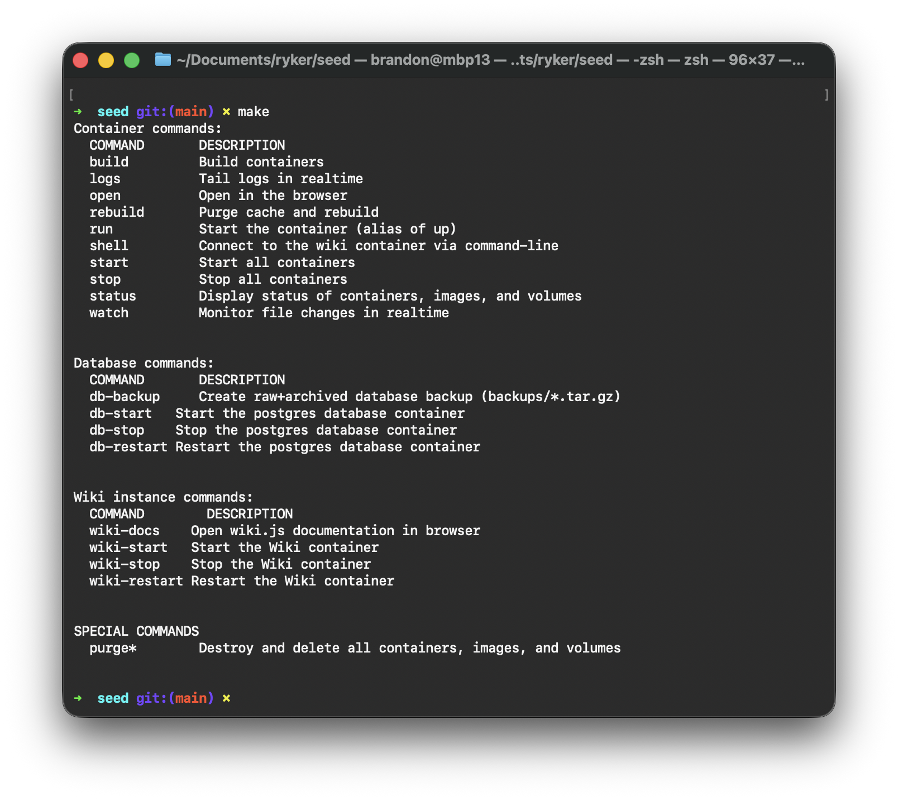

[](https://dl.circleci.com/status-badge/redirect/gh/rykerdefense/seed/tree/main)

# **SEED (Self-contained Emergency Education Database)**
### *Ryker Defense*


## Installation (macos/linux)

### Dependencies/pre-requisites

This project leverages Docker, a platform-agnostic, virtualization technology known as "containerization", with ≈95% compatibility on modern systems (MacOS, Linux, Windows, Android) across a spectrum of CPU architectures (multiple CPU architectures (x86-64, ARM64, ARMv7, s390x, etc.)

**To install on MacOS:**
- copy the following code using the button at the top-right of the box
- open up the Terminal app (/Applications/Utilities/Terminal.app)
- paste the code into the window and press `<Enter>`.


```bash
/bin/bash -c "$(curl -fsSL https://raw.githubusercontent.com/Homebrew/install/HEAD/install.sh)"
brew install --cask docker-desktop
open -a Docker.app
```
*Note: it may prompt you once or twice for your administrator password, both within the terminal window and when running the Desktop application for the first time. The process will likely take 5-10 minutes.*

### Software Installation

1. Open the Terminal application and navigate to desired folder for installation location.
2. Clone repository (ssh preferred)
3. Change into base project directory
4. Copy the example credentials file into its working form within the base directory
5. type `make build`


**From terminal:**

***Copy the following code using the button to the top right of this box, paste it into the Terminal app and press `<Enter>`.***

```bash
open
mkdir -p ~/Documents/projects
cd ~/Documents/projects
github repo clone rykerdefense/seed
cd seed
cp config/env.dev.example .env
make build
```
*Note: for the initial installation, you will be prompted to enter the administrator password to modify the hosts/network configuration. This is only required once and will never be necessary again in the future.*


## General usage
#### The `make` command
This is the command and control center for the project with a robust and intuitive feature set and documentation to allow a high level of granular control over running, debugging, using, learning, and troubleshooting for both developers and first-timers using the command-line alike.

##### To see a list of available commands and their descriptions, simply type:
```bash
make
``` 
and press `<Enter>`.

##### To run a command, type:
```
make <subcommand>
```
and press `<Enter>`.



### TO-DO:

```
-
-
-

```
